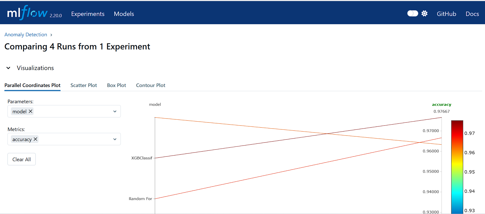

# GenAI Mlflow Project

## Project Description
This project leverages Mlflow for managing the machine learning lifecycle, including experimentation, reproducibility, and deployment.

## Screenshot


## Setup Instructions
1. Clone the repository:
    ```sh
    git clone https://github.com/rrpatil-1/mlflow_tutorial.git
    ```
2. Navigate to the project directory:
    ```sh
    cd mlflow_tutorial
    ```
3. Create and activate a virtual environment:
    ```sh
    python -m venv venv
    source venv/bin/activate  # On Windows use `venv\Scripts\activate`
    ```
4. Install the required dependencies:
    ```sh
    pip install -r requirements.txt
    ```

### Setting up Mlflow Environment
1. Install Mlflow:
    ```sh
    pip install mlflow
    ```
2. Initialize a new Mlflow project:
    ```sh
    mlflow init
    ```
3. Configure the backend store and artifact store in `mlflow.yml`:
    ```yaml
    backend_store_uri: sqlite:///mlflow.db
    default_artifact_root: ./mlruns
    ```

## Usage
1. Run the Mlflow server:
    ```sh
    mlflow ui
    ```
2. Start your experiments and track them using Mlflow.

## Contributing
1. Fork the repository.
2. Create a new branch (`git checkout -b feature-branch`).
3. Make your changes.
4. Commit your changes (`git commit -m 'Add some feature'`).
5. Push to the branch (`git push origin feature-branch`).
6. Open a pull request.

## License
This project is licensed under the MIT License.
